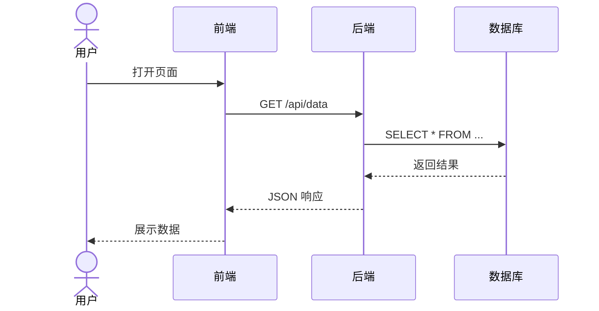

# UML 时序图生成 Skill

## 核心目标

根据用户描述的系统交互流程，生成 **Mermaid sequenceDiagram** 代码，并渲染为符合论文要求的 PNG 图片。

## 设计风格

- **背景**：白色
- **线条**：黑色
- **文本**：黑色
- **风格**：学术论文用，简洁清晰

## 输出格式

**输出 Mermaid sequenceDiagram 代码**，并可选择渲染为 PNG。

### 基础语法



### 箭头类型

| 语法 | 含义 |
|------|------|
| `->>` | 实线箭头（同步调用） |
| `-->>` | 虚线箭头（返回/异步） |
| `->>+` | 实线箭头 + 激活（开始执行） |
| `-->>-` | 虚线箭头 + 去激活（执行完毕） |

## 生成 PNG

### 方式一：直接渲染 .mmd 文件

```bash
npx -y @mermaid-js/mermaid-cli -i sequence.mmd -o sequence.png -b white
```

### 方式二：使用本项目的 CLI 工具（推荐）

```bash
cd ~/projects/dc-skills/diagram-sequence
uv run python -m scripts.cli \
  --json-file docs/sequence/json/<name>.json
```

当输入文件使用**绝对路径**时，CLI 会自动推断项目目录（向上查找包含 `docs/` 或 `thesis-output/` 的目录），默认输出到 `<项目目录>/thesis-output/diagram-sequence/sequence-diagram.png`；中间 `.mmd` 文件自动存放到 `~/.claude/skills-output/diagram-sequence/`。如使用相对路径或无法推断，则回退到 `~/.claude/skills-output/diagram-sequence/sequence-diagram.png`。如需自定义路径：

```bash
cd ~/projects/dc-skills/diagram-sequence
uv run python -m scripts.cli \
  --json-file docs/sequence/json/<name>.json \
  --out <自定义路径>.png
```

## 目录结构

```
docs/sequence/
├── json/       # JSON 数据文件

~/.claude/skills-output/diagram-sequence/    # 生成的时序图 PNG 及中间文件（默认输出目录）
```

## JSON 文件规范

### 基本结构

所有生成的时序图均包含统一的字体配置（宋体 12px），确保与论文风格一致。

```json
{
  "title": "用户登录时序图",
  "participants": [
    {"name": "用户", "type": "actor"},
    {"name": "前端组件", "type": "participant"},
    {"name": "后端服务", "type": "participant"},
    {"name": "数据库", "type": "database"}
  ],
  "messages": [
    {"from": "用户", "to": "前端组件", "text": "输入账号密码"},
    {"from": "前端组件", "to": "后端服务", "text": "POST /login"},
    {"from": "后端服务", "to": "数据库", "text": "查询用户信息"},
    {"from": "数据库", "to": "后端服务", "text": "返回用户记录", "dashed": true},
    {"from": "后端服务", "to": "后端服务", "text": "验证密码", "activate": true},
    {"from": "后端服务", "to": "前端组件", "text": "返回Token", "dashed": true, "deactivate": true},
    {"from": "前端组件", "to": "用户", "text": "登录成功", "dashed": true}
  ]
}
```

### 字段说明

- `title`: 时序图标题（可选）
- `participants`: 参与者列表
  - `name`: 参与者名称
  - `type`: 类型，可选 `actor`（人形）、`participant`（矩形）、`database`（圆柱）
- `messages`: 消息列表
  - `from`: 发送方
  - `to`: 接收方
  - `text`: 消息内容（简洁，不超过15字）
  - `dashed`: 是否虚线（返回消息设为 true）
  - `activate`: 是否激活接收方生命周期
  - `deactivate`: 是否去激活发送方生命周期
  - `note`: 备注文字（可选，显示在消息旁）

## 时序图生成命令

```bash
cd ~/projects/dc-skills/diagram-sequence
uv run python -m scripts.cli \
  --json-file docs/sequence/json/login.json
```

## 示例

### 用户在线选座时序图

```json
{
  "title": "用户在线选座时序图",
  "participants": [
    {"name": "用户", "type": "actor"},
    {"name": "前端组件", "type": "participant"},
    {"name": "后端服务", "type": "participant"},
    {"name": "数据库", "type": "database"}
  ],
  "messages": [
    {"from": "用户", "to": "前端组件", "text": "打开购票页面"},
    {"from": "前端组件", "to": "后端服务", "text": "请求排片信息和座位布局"},
    {"from": "后端服务", "to": "数据库", "text": "findById获取排片详情"},
    {"from": "数据库", "to": "后端服务", "text": "返回排片详情", "dashed": true},
    {"from": "后端服务", "to": "前端组件", "text": "返回座位预订列表", "dashed": true},
    {"from": "用户", "to": "前端组件", "text": "选择座位"},
    {"from": "前端组件", "to": "前端组件", "text": "触发handleSelect"},
    {"from": "前端组件", "to": "后端服务", "text": "提交购物车"},
    {"from": "后端服务", "to": "数据库", "text": "创建购物车记录"},
    {"from": "数据库", "to": "后端服务", "text": "创建成功", "dashed": true},
    {"from": "后端服务", "to": "前端组件", "text": "返回成功响应", "dashed": true},
    {"from": "前端组件", "to": "用户", "text": "显示加入购物车成功", "dashed": true}
  ]
}
```

生成命令：

```bash
cd ~/projects/dc-skills/diagram-sequence
uv run python -m scripts.cli \
  --json-file docs/sequence/json/seat-select.json
```

### 推荐模块时序图

```json
{
  "title": "用户推荐模块时序图",
  "participants": [
    {"name": "前端", "type": "participant"},
    {"name": "后端", "type": "participant"},
    {"name": "数据库", "type": "database"}
  ],
  "messages": [
    {"from": "前端", "to": "后端", "text": "GET /recommend?uid=xxx"},
    {"from": "后端", "to": "数据库", "text": "查询用户订单记录"},
    {"from": "数据库", "to": "后端", "text": "返回订单记录", "dashed": true},
    {"from": "后端", "to": "后端", "text": "筛选同类电影", "activate": true},
    {"from": "后端", "to": "数据库", "text": "查询同类型电影"},
    {"from": "数据库", "to": "后端", "text": "返回电影列表", "dashed": true},
    {"from": "后端", "to": "后端", "text": "排除已观看", "deactivate": true},
    {"from": "后端", "to": "前端", "text": "返回推荐列表", "dashed": true}
  ]
}
```

## 环境管理（统一规范）

```bash
cd ~/projects/dc-skills
uv sync
```

- Python 依赖统一在根目录 `pyproject.toml` 管理，不在子目录单独安装
- 各 skill 子目录无需创建 `.venv`，`uv run` 会自动向上查找到根目录的虚拟环境
- Mermaid CLI 推荐通过 `npx -y @mermaid-js/mermaid-cli` 调用，避免全局安装

## 自检清单

输出前检查：
- [ ] 参与者名称简洁清晰
- [ ] 消息方向正确（请求→实线，返回→虚线）
- [ ] 生命周期激活/去激活配对正确
- [ ] 消息文字不超过15字
- [ ] 背景为白色（`-b white`）
- [ ] 图片导出为 PNG 格式
